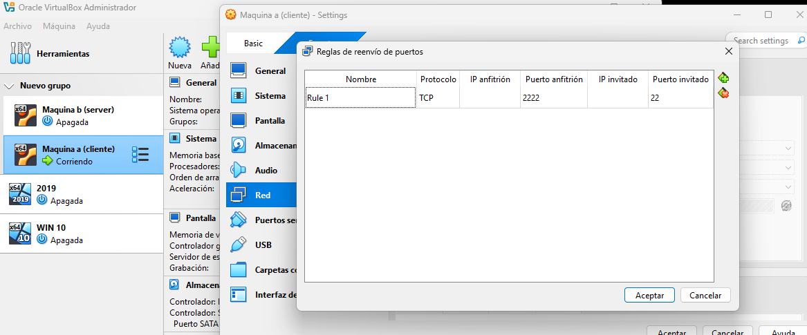
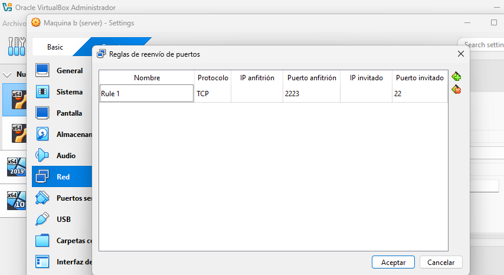
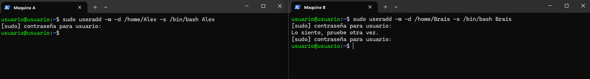
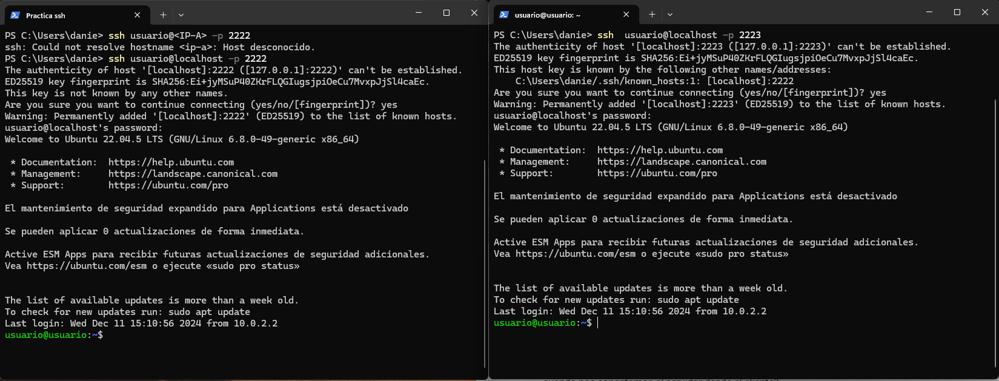
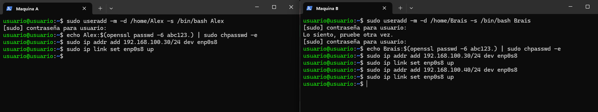
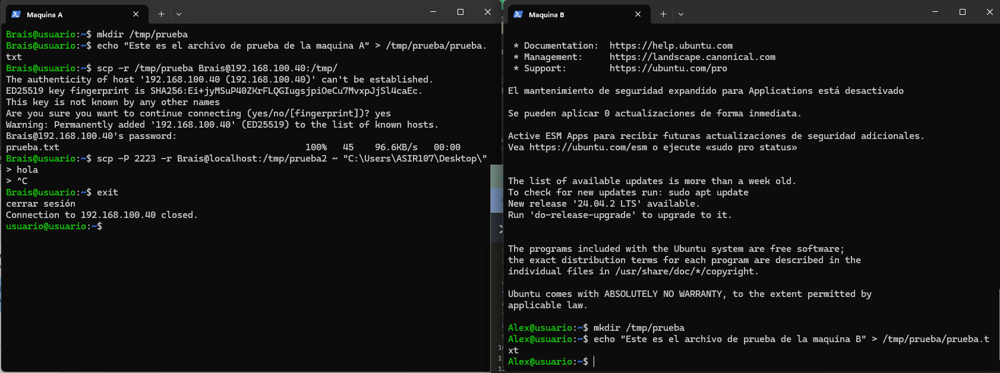
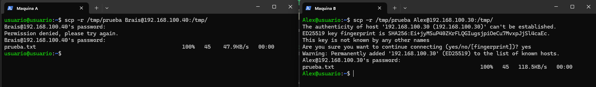
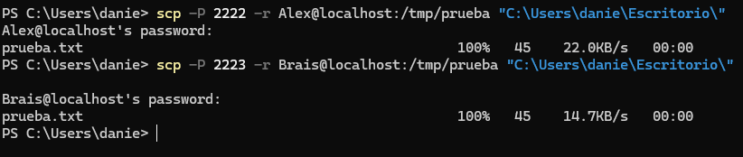
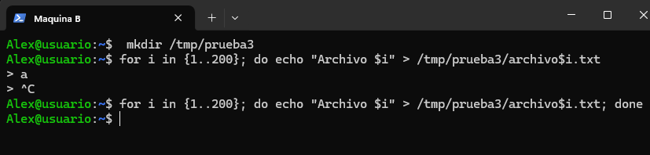

# Tarea de SSH y SCP

## 1. Configuración de las máquinas virtuales

- Crear dos máquinas virtuales: **Máquina A** y **Máquina B**
- Configuración de red:
  - **Adaptador 1**: Tipo NAT
    - Una máquina con el reenvío de puertos predeterminado
    - La otra con el puerto **2223**
  - **Adaptador 2**: Tipo **Red Interna**
    - Para la comunicación entre las dos máquinas

## 2. Conexión por SSH

- Conectarse por SSH a ambas máquinas
- Crear usuarios: **Alex** y **Brais** en las respectivas máquinas
- Configurar la IP estática de ambas máquinas

## 3. Conexión entre máquinas

- Desde **Máquina A** conectarse por SSH a **Máquina B**
- Conectarse mutuamente desde A a B y de B a A
- En cada máquina:
  - Crear un directorio en `/tmp`
  - Dejar un archivo como prueba

## 4. Transferencia de archivos

- Copiar el archivo creado en cada máquina a la otra

- Copiar los archivos de ambas máquinas a la **máquina nativa**

## 5. Creación de directorio y transferencia masiva

- Crear el directorio `prueba3`
- Generar **200 archivos**

- Transferir el directorio a la máquina nativa

## 6. Autenticación por clave SSH

- Desde **Máquina A**, generar una clave SSH

- Copiar la clave pública a **Máquina B**

- Conectarse sin contraseña, usando autenticación por **frase de paso**

---

> ✨ *Recuerda verificar que el servicio SSH esté activo en ambas máquinas y que el puerto configurado sea accesible desde tu red.*
