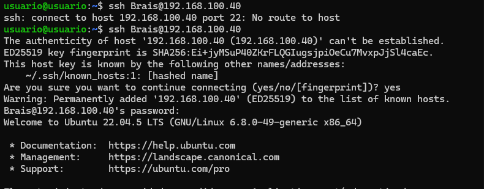

# Tarea de SSH y SCP

## 1. Configuración de las máquinas virtuales

- Crear dos máquinas virtuales: **Máquina A** y **Máquina B**
- Configuración de red:
  - **Adaptador 1**: Tipo NAT
    - Una máquina con el reenvío de puertos predeterminado
    - La otra con el puerto **2223**
  - **Adaptador 2**: Tipo **Red Interna**
    - Para la comunicación entre las dos máquinas

## 2. Nos conectamos por ssh a las dos máquinas 

Y añadimos correspondientes Alex y Brais a las respectivas máquinas 

Finalmenta configuramos la ip de las dos maquinas 

## 4. Conexion entre máquinas

- Nos conectamos a la maquina B desde la máquina A 

- Ahora nos conectamos a cada maquina entre ellas respectivamente para crear un directorio en /tmp dejando un archivo en cada maquina como prueba de haberlo conseguido  

 - Por ultimo copiamos respectivamente de cada maquina el archivo que hemos creado

 
## 5. Transferencia de archivos

- Copiamos los archivos de cada máquina a nuestra máquina nativa

- Ahora creamos el directorio prueba3 para crear los 200 archivos

- Y nos lo pasamos a nuestro ordenador

## 6. Claves

- generamos la clave Desde A

- Y se la pasamos a la máquina B  

- Y por último nos conectamos por frase 

